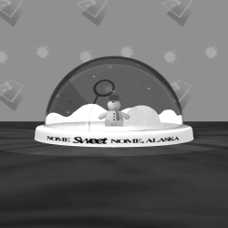
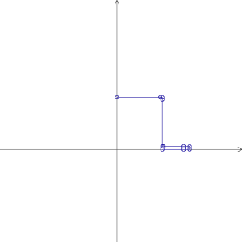
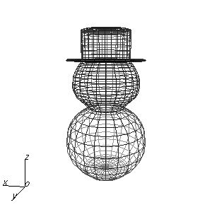
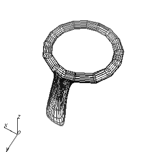
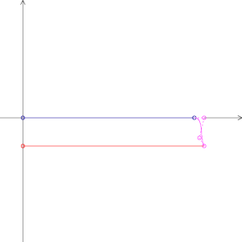
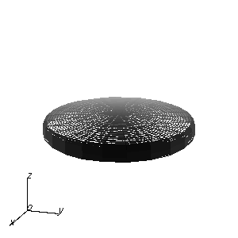
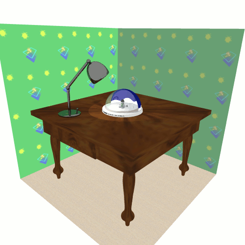
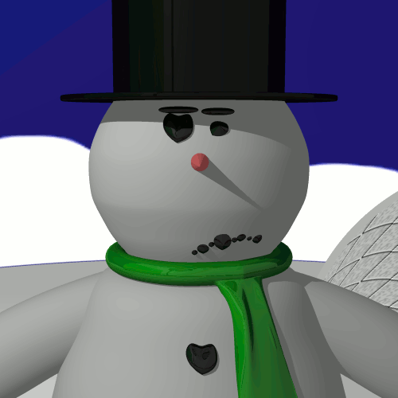

# Knick Knack



Progetto del corso di Grafica (26 maggio 2008) del corso di laurea in Scienze e Tecnologie Informatiche - Università degli Studi di Bologna.

- [Tutorial originale del progetto](https://www.dm.unibo.it/~casciola/php/public_html/projects/2008/tutorials/KnickKnack/index.html)
- Sito di [XCModel](http://www.dm.unibo.it/~casciola/html/xcmodel.html)

## Obiettivi

Utilizzando i programmi *XCCurv*, *XCSurf* e *XCRayt* di *XCModel 4.0*, realizzare un'esperienza significativa di modellazione e resa realistica insieme alla progettazione di una breve animazione digitale: si tratta di riprogettare, in modellazione 3D, un personaggio di un film di animazione e di inserirlo in una scena. Il personaggio scelto è [Knick Knack](https://www.imdb.com/title/tt0097674/), protagonista di un cortometraggio della [Pixar Animation Studios](https://www.pixar.com/) datato 1989.

## Progettazione degli oggetti della scena e delle superfici

*XCCurv* e *XCSurf* mettono a disposizione, rispettivamente, un tool di progettazione di curve bidimensionali ed un ambiente di modellazione di superfici NURBS *trimmate*. In questa sezione viene descritta la progettazione delle superfici utilizzate per formare gli oggetti della scena; gli oggetti rimanenti (cioè il tavolo e la lampada) sono stati scaricati dal [database di oggetti di XCModel](https://www.dm.unibo.it/~casciola/php/public_html/DataBase/viewDataBase.php).

### Knick Knack: il pupazzo di neve

Knick knack è il protagonista della scena. È composto principalmente da due superfici di rivoluzione: il corpo ed il cappello, come mostrato nelle figure 1, 2 e 3. Inoltre è composto da un naso (un semplice cono), da due gambe (due cilindri posti perpendicolarmente al piano XZ) e da due braccia, ottenute per estrusione da tre cerchi.

|  |  |  |
| :--: | :--: | :--: |
| *Figura 1: Curva profilo del corpo* | *Figura 2: Curva profilo del cappello* | *Figura 3: Superfici di rivoluzione "corpo" e "cappello"* |

|  |  |
| :--: | :--: |
| *Figura 4: Curve profilo di alcuni "bottoni"* | *Figura 5: Modello gerarchico "cravatta"* |

Inoltre sono presenti dei piccoli "bottoni" ottenuti per *skinning* dalle curve in Figura 4. Questi vanno a comporre la bocca, gli occhi ed i tre bottoni della giacca; bisogna posizionarli manualmente sul corpo in modo che lo compenetrino leggermente per ottenere l'effetto profondità e la proiezione dell'ombra sul corpo. In più le sopracciglia sono ricavate da un cilindro, scalato e posizionato opportunamente, a cui è stato aumentato il grado di un'unità.

Infine la cravatta: si tratta di un semplice toroide modellato gerarchicamente per far uscira la "lingua" e incurvato fino al punto desiderato grazie allo strumento interattivo di "bending"; il risultato è analogo a quello di Figura 5.

### La "boccia" di vetro (o cupola)

La cupola si ottiene come superficie di rivoluzione a partire dalle tre curve profilo di Figura 6; il risultato è quello di Figura 7. Il tetto è una sfera, che viene trimmata una volta per ottenere una semisfera ed in seguito deformata per renderla lievemente irregolare: per farlo basta traslare leggermente i punti di controllo superiori della semisfera nel verso negativo dell'asse Y. Infine la superficie ottenuta viene nuovamente trimmata: la parte anteriore (la più grande) sarà il vetro della "boccia", mentre la parte posteriore sarà *texturata* per ottenere lo sfondo della boccia. Il modello risultante è mostrato in figura 8.

|  |  |  |
| :--: | :--: | :--: |
| *Figura 6: Curve profilo della base della cupola* | *Figura 7: Superficie di rivoluzione "base cupola"* | *Figura 8: "Tetto" della cupola* |

### L'igloo

L'igloo viene prodotto per estrusione dalle curve profilo di figura 9. Per realizzarle si può effettuare un join tra due semicerchi: uno più grande (quello di destra) ed uno più piccolo (a sinistra) che viene poi *stretchato* per renderlo più longilineo. Il risultato è simile a quello in figura 10. Bisogna separare la faccia anteriore da quella posteriore per applicarvi due texture diverse (una con l'entrata, una senza).

|  |  |
| :--: | :--: |
| *Figura 9: Curve profilo dell'igloo* | *Figura 10: Superfici di estrusione dell'igloo* |

## Descrizone della scena e animazione

La libreria C *descriptor* del pacchetto *XCModel 4.0* mette a disposizione un set di funzioni per la definizione e la manipolazione delle scene 3D, intese come liste di superfici NURBS trimmate, punti luce, attributi dei materiali, viewpoint, ecc...

### L'ambiente statico

Per descrivere la scena avremo bisogno di definirne (once-and-for-all) l'aspetto di base. Scriviamo innanzitutto una procedura di costruzione di un "ambiente", inteso come background, luce ambiente, punti luce e attributi degli oggetti. L'ambiente rimarrà lo stesso per tutte le scene, perciò ci riferiremo ad esso come *statico* (eventualmente sarebbe possibile creare delle variabili globali per i punti luce, per poterli modificare successivamente).

```C
void build_environment(void)
{
    /*** Impostazione colore e luci ambiente ***/
    set_background(1.0, 1.0, 1.0, TRUE);
    set_ambient_light(1.0, 1.0, 1.0, 0.7);
    create_point_light(2.320, 10.203, 15.992, 1.0, 1.0, 1.0, 0.75, 35, "Luce_Lampada");
    create_point_light(2.996, 3.896, 5.777, 1.0, 1.0, 1.0, 0.75, 10, "Luce_Cupola");

    /*** Attributo 1 ***/
    sfondo_attr = create_attribute("sfondo_attr");
    set_color(sfondo_attr, 1.0, 1.0, 1.0, 1.0, 1.0);
    set_reflectivity(sfondo_attr, 0.0, 128);
    set_transparency(sfondo_attr, 0.4, 0.2, 5, 1.0);

    /*** Attributo 2 ***/
    corpo_attr = create_attribute("corpo_attr");
    set_color(corpo_attr, 0.9, 0.9, 0.9, 0.6, 1.0);
    set_reflectivity(corpo_attr, 0.0, 128);

    ...
}
```

### Definizione trasformazioni nel tempo

Considereremo la scena in funzione del fotogramma corrente nell'animazione: in questo modo sarà sufficiente scrivere una sola volta il codice della scena (tramite la libreria *descriptor*), invece che duplicarlo in "scena statica" e "scena animata". La scena statica sarà semplicemente il primo fotogramma dell'animazione. Scriviamo pertanto le trasformazioni dello stato degli oggetti dinamici nel tempo, fotogramma per fotogramma, come array di triplette per traslazioni, fattori di scala e rotazioni.

```C
/* Tipo tripletta di numeri floating-point */
typedef float vect3f [3];

/* Numero di fotogrammi dell'animazione */
const unsigned Anim_Frames = 42;

/* Fattori di scala per gli occhi */
const vect3f frame_scala_occhi[] = {
    /* Frame  0 */ {1.0, 1.0, 1.0},
    /* Frame  1 */ ...
    /* ...      */ ...
    /* Frame 41 */ ...
};

/* Traslazioni delle bolle */
const vect3f frame_pos_bolla[] = {
    /* Frame  0 */ {0.0, 0.0, 0.0},
    /* Frame  1 */ ...
    /* ...      */ ...
    /* Frame 41 */ ...
};

...
```

### Costruzione dello scenario statico

Oltre all'ambiente statico, vi sarà una parte di scena invariante nel tempo (una sorta di scenario statico). Scriviamo una procedura di costruzione della parte statica della scena (i.e. lista di oggetti che non variano tra i fotogrammi).

```C
ITEM build_static_scene(unsigned frameno)
{
ITEM scene, item;

    /*** Pareti ***/
    item = read_nurbs("plane.db");
    set_domain_texture(item, sfondo_attr, "textures/pavimento.hr", 0.0, 0.25, 0.0, 0.25, 1, 1.0, 1.0);
    set_scale(item, 30.0, 30.0, 30.0);
    set_translate(item, 0.0, 0.0, -30.0);
    scene = create_list(item, "Ambiente");

    item = read_nurbs("plane.db");
    set_domain_texture(item, sfondo_attr, "textures/sfondo.hr", 0.0, 0.25, 0.0, 0.25, 1, 1.0, 1.0);
    set_y_rotate(item, 90.0, 1);
    set_x_rotate(item, 90.0, 1);
    set_scale(item, 30.0, 30.0, 30.0);
    set_translate(item, 30.0, 0.0, 0.0);
    scene = insert_in_list(scene, item);

    item = read_nurbs("plane.db");
    set_domain_texture(item, sfondo_attr, "textures/sfondo.hr", 0.0, 0.25, 0.0, 0.25, 1, 0.5, 1.0);
    set_scale(item, 30.0, 30.0, 30.0);
    set_x_rotate(item, 90.0, 1);
    set_translate(item, 0.0, -30.0, 0.0);
    scene = insert_in_list(scene, item);

    /*** Tavolo ***/
    item = read_obj("tavolo.obj", "Tavolo1");
    set_translate(item, -50.0, -50.0, -67.5);
    set_scale(item, 0.52, 0.5, 0.450450);
    set_domain_texture(item, tavolo_attr, "textures/wood3.hr", 0.0, 0.5, 0.0, 0.5, 1, 1.0, 1.0);
    scene = insert_in_list(scene, item);

    /*** Lampada ***/
    item = read_obj("lampada.obj", "Lampada1");
    set_z_rotate(item, 135.0, 1);
    set_translate(item, 85.0, 85.0, 0.0);
    set_scale(item, 0.1953125, 0.1953125, 0.1953125);
    set_attribute(item, lampada_attr);
    scene = insert_in_list(scene, item);

    return scene;
}
```

### Costruzione del pupazzo di neve

Ora si tratta di descrivere il resto della scena, quella che potrebbe mutare durante l'animazione. Scriviamo perciò una funzione, parametrica nel fotogramma corrente, per ogni oggetto dinamico della scena (Pupazzo di neve, Cupola, Igloo, ...), usando gli attributi dell'ambiente statico e le triplette di trasformazione definiti in precedenza.

```C
ITEM build_knick_knack(unsigned frameno)
{
ITEM knick_knack, item;

    /*** Corpo ***/
    item = read_obj("corpo.obj", "Corpo");
    set_attribute(item, corpo_attr);
    knick_knack = create_list(item, "Knick_Knack");

    /*** Occhi ***/
    item = read_nurbs("occhio1.db");
    set_scale(item, frame_scala_occhi[frameno][0], frame_scala_occhi[frameno][1], frame_scala_occhi[frameno][2]);
    set_translate(item, 0.108, 0.583, 2.361);
    set_attribute(item, occhi_attr);
    knick_knack = insert_in_list(knick_knack, item);

    item = read_nurbs("occhio2.db");
    set_scale(item, frame_scala_occhi[frameno][0], frame_scala_occhi[frameno][1], frame_scala_occhi[frameno][2]);
    set_translate(item, -0.100, 0.569, 2.347);
    set_attribute(item, occhi_attr);
    knick_knack = insert_in_list(knick_knack, item);

    /*** Bocca ***/
    item = read_obj("bocca.obj", "Bocca");
    set_attribute(item, bocca_attr);
    knick_knack = insert_in_list(knick_knack, item);

    ...

    return knick_knack;
}
```

### Funzione principale di costruzione delle scene

Scriviamo la funzione di costruzione della scena parametrica nel fotogramma corrente e nel nome della scena stessa, che richiami le funzioni di costruzione viste fin qui (ad eccezione dell'ambiente statico, poiché quello viene costruito una volta per tutte prima di cominciare ad iterare attraverso i fotogrammi dell'animazione).

```C
ITEM build_scene_frame(unsigned frameno, const char *scene_name)
{
ITEM scene, item;

    /*** Scenario (statico) ***/
    item = build_static_scene();
    scene = create_list(item, scene_name);

    /*** Knick Knack ***/
    item = build_knick_knack(frameno);
    set_translate(item, 0.0, 0.0, M);
    scene = insert_in_list(scene, item);

    /*** Cupola ***/
    item = build_cupola(frameno);
    set_translate(item, 0.0, 0.0, 0.175); 
    set_scale(item, 7.0, 7.0, 7.0);
    scene = insert_in_list(scene, item);

    /*** Igloo ***/
    item = build_igloo(frameno);
    set_scale(item, 2.0, 2.0, 2.0);
    set_translate(item, -1.0, -2.0, M);
    scene = insert_in_list(scene, item);

    /*** Bolla 1 ***/
    if(frameno > 0) {
        item = read_nurbs("bolla.db");
        set_attribute(item, bollicine_attr);
        set_translate(item, frame_pos_bolla[frameno][0], frame_pos_bolla[frameno][1], frame_pos_bolla[frameno][2]);
        scene = insert_in_list(scene, item);
    }

    /*** Bolla 2 ***/
    if(frameno >= 10) {
        item = read_nurbs("bolla.db");
        set_attribute(item, bollicine_attr);
        set_translate(item, frame_pos_bolla[frameno - 10][0], frame_pos_bolla[frameno - 10][1], frame_pos_bolla[frameno - 10][2]);
        scene = insert_in_list(scene, item);
    }

    /*** Bolla 3 ***/
    if(frameno >= 15) {
        item = read_nurbs("bolla.db");
        set_attribute(item, bollicine_attr);
        set_translate(item, frame_pos_bolla[frameno - 15][0], frame_pos_bolla[frameno - 15][1], frame_pos_bolla[frameno - 15][2]);
        scene = insert_in_list(scene, item);
    }

    return scene;
}
```

### Main function

Infine, scriviamo la main function che non fà altro che costruire l'ambiente statico ed iterare su ogni fotogramma la costruzione ed il salvataggio della scena corrente.

```C
int main(void)
{
ITEM scene;
unsigned i;

    /*** Costruisce l'ambiente (attributi, luci, ...) ***/
    build_environment();

    /*** Per ogni fotogramma i dell'animazione ***/
    for(i = 0; i < Anim_Frames; i++) {
        /*** Costruisce la scena per il fotogramma i ***/
        scene = build_scene_frame(i, "Knick_Knack");

        /*** Salva il fotogramma ottenuto ***/
        save_scene_ani(Anim_Frames, "Knick_Knack_Anim.ani", "Knick_Knack_Anim", "Knick_Knack", scene);
    }

    return 0;
}
```

## Alcune immagini di resa

|  |  |
| :--: | :--: |
|  |  |

## Problemi e bug

Non avere a disposizione degli strumenti di modellazione solida si traduce in un notevole handicap: questo comporta anche la difficoltà (e spesso l'impossibilità) di applicare *texture* o *mappe a sbalzo* ad oggetti composti da più superfici. Inoltre gli strumenti interattivi di *XCSurf* sono spesso controintuitivi. Infine *XCSurf* *crasha* spesso inaspettatamente e soffre di alcuni altri bug più sistematici.

Il formato *.hr* è molto scomodo, specialmente in assenza di pratici *tool* di conversione: se *XCView* fosse pensato per accettare parametri a riga di comando ed agire in *batch-mode* si potrebbe agevolmente integrare con degli script di "conversione di massa" (in realtà potrebbe essere già pensato così: l'impossibilità di saperlo deriva dalla scarsa documentazione e dal fatto che NON È CORREDATO DEL CODICE SORGENTE!!!).

In pratica il maggior disagio si manifesta nel dover convertire uno per uno i file *.hr* in *.ppm* (reinserendone di volta in volta il nome).

Non sono stato inoltre capace di usare la funzione EXPORT, forse a causa di un bug (crea sempre file corrotti), perciò per produrre un *.gif* ho dovuto salvare come *.ppm*, aprire con GIMP (o un altro editor a scelta) ed esportare come *.gif*. Ovviamente tutto ciò diventa particolarmente frustrante nel contesto della conversione di un'animazione.

Tutta la *suite* soffre di gravi pecche di compatibilità coi driver del server X, probabilmente dovuti all'opzione di *backing-store*, usa troppe finestre che potrebbero essere riassunte in un'unica vista e pur non richiedendo molte risorse, diventa pesante se resta aperta molto a lungo, probabilmente di nuovo per la *backing-store feature* (il sistema dovrà allocare un certo spazio per salvare il contenuto di ogni finestra non visualizzata, che col tempo finirà nell'area di *swap* sull'hard-disk). Sul mio sistema è insensibile al tasto di chiusura (intendo la *x* in alto a destra) ed ha alcuni difetti grafici nella visualizzazione del *hint* dei comandi.

In definitiva molte cose che dovrebbero essere semplici diventano ostiche, alcuni banali quesiti rimangono insoluti:
- perché non prendere spunto da alcuni prodotti commerciali per creare delle procedure di modellazione più user-friendly?
- perché non utilizzare delle librerie di conversione per *.gif*, *.jpeg* ecc... invece di riscrivere il codice di conversione?
- perché non innalzare un po' il livello d'astrazione dalle finestre ed appoggiarsi sulla *glib* o sulle *Qt* anziché sulle primitive di *Xlib*?
- perché non pubblicare il codice sorgente sotto licenza *open source* (questo favorirebbe di certo la realizzazione "spontanea" da parte della comunità di alcuni dei punti sopra)?

*"Meritate di poter cooperare apertamente e liberamente con altre persone che usano software.  
Meritate di poter imparare come funziona il software e con esso di insegnare ai vostri studenti.  
Meritate di poter assumere il vostro programmatore favorito per aggiustarlo quando non funziona.  
Meritate il software libero."*  
  
(Free Software, Free Society: The Selected Essays of Richard M. Stallman, GNU Press, 2002)

    Versione: 1.0
    Copyright (C) 2008 Andrea Simonetto
	Adattato per Markdown: 27 luglio 2024
    CC BY-NC-ND-SA 4.0
