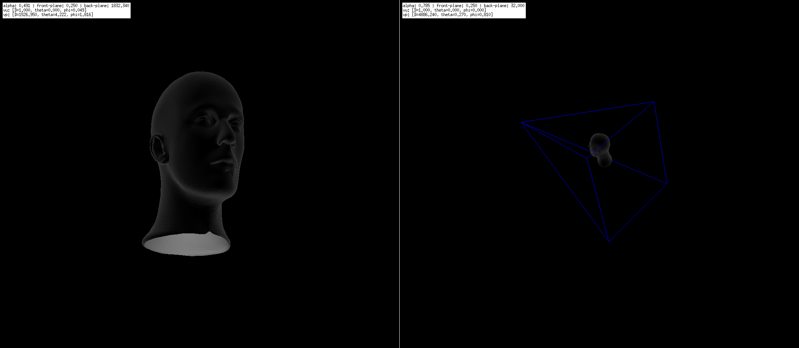

# persp_cube2

Il programma implementa il caricamento di file mesh (`.m`, `.obj`, `.ply`) **a facce triangolari**.

La visualizzazione si appoggia unicamente alle primitive grafiche X. L'algoritmo di resa è un *Hidden Surface* basato su Z-buffer mentre l'illuminazione è gestita tramite un semplice *Flat Shading*.



Il file d'intestazione `scene3d.h` contiene i prototipi delle primitive di gestione delle scene 3D. Per creare/eliminare una scena:

```C
	scene3d_create(Xdpy, width, height, depth);
	scene3d_delete(scene3d);
```

È possibile aggiungere/rimuovere da una scena un numero arbitrario di oggetti mesh mediante le funzioni:

```C
	scene3d_object_add(scene3d, obj_name, obj_mesh);
	scene3d_object_delete(scene3d, obj_name);
```

L'header file `mesh3d.h` contiene le primitive di gestione delle mesh. Per caricare una mesh da file:

```C
	mesh3d_load(mesh_path);
```

Ogni mesh, che sia caricata da file o creata dinamicamente, deve essere esplicitamente deallocata. Ecco le primitive di creazione/eliminazione:

```C
	mesh3d_create(vertices_num, faces_num, edges_num);
	mesh3d_delete(mesh3d);
```

La resa di una scena passa attraverso la primitiva `scene3d_render()` che disegna in una immagine X la scena resa. L'immagine è contenuta nel campo ximage della struttura `scene3d_t`. Ecco uno snippet per il caricamento, la resa e la visualizzazione di una mesh:

```C
display_mesh(Xdpy, Xwindow, XGC, mesh_path)
{
	/* Load the mesh from file */
	mesh3d_t *mymesh = mesh3d_load(mesh_path);
	if(!mymesh) 
		throw("Cannot load mesh '" + mesh_path + "'");

	/* Create an empty scene */
	scene3d_t *myscene = scene3d_create(Xdpy, 320, 200, 32);
	
	/* Add the mesh to the scene */
	scene3d_object_add(myscene, "myMesh", mymesh);
	
	/* Render the scene */
	scene3d_render(myscene);

	/* Display the scene on the window */
	XPutImage(Xdpy, Xwindow, XGC, myscene->ximage, 0, 0, 0, 0, 320, 200);

	/* Free allocated resources */
	scene3d_delete(myscene);
	mesh3d_delete(mymesh);
}
```


    Ultima modifica: Maggio 2008
	Adattato per Markdown: 27 luglio 2024
