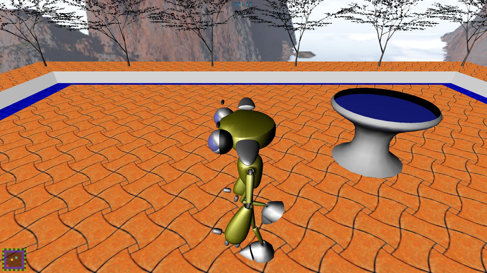
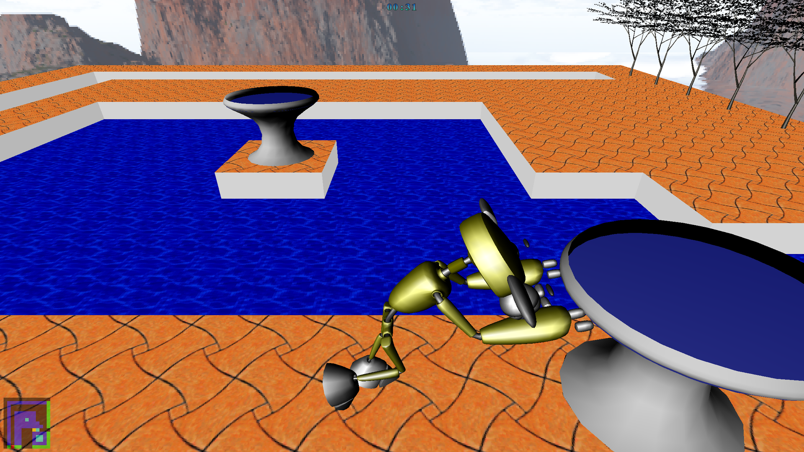
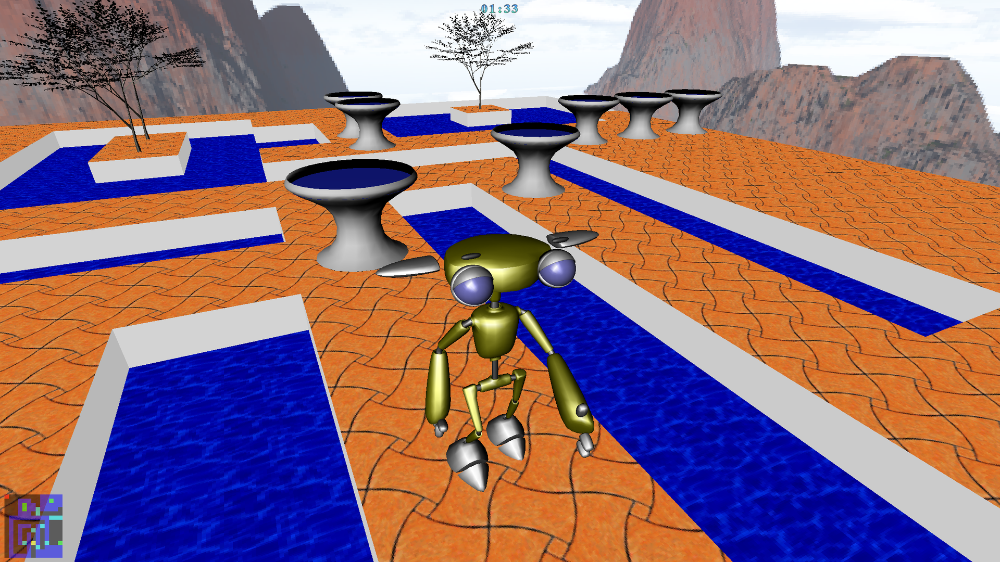

# UPLEZZ v1.0

## Prerequisiti
- Strumenti: g++, binutils, make, flex
- Librerie: GL, X11, math
- Opzionale, per la documentazione: [Doxygen](https://www.doxygen.nl/)

## Compilazione
Per compilare il programma, eseguire il comando `make`. Per generare la  documentazione, eseguire `make doc`. Per pulire il source-tree: `make clean`.

## Esecuzione
Per avviare il gioco, lanciare l'eseguibile `./uplezz`. Un help online è accessibile dal gioco col tasto F1. Gli snapshot si trovano nella cartella `uplezz/data/snapshots`. I livelli invece in `uplezz/data/grids`.

I programmi di test non sono compilati normalmente: se si vuole eseguire il  programma di test del modulo MRE, entrare nella cartella `uplezz/src/mre` ed eseguire `make test` seguito da `./test`. Analogo per il modulo MGE.

    Ultima modifica: Ottobre 2008
	Adattato per Markdown: 27 luglio 2024
